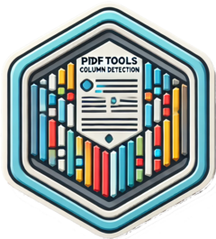

```{r setup, include=FALSE}
knitr::opts_chunk$set(warning = FALSE, message = FALSE) 
```

<!-- README.md is generated from README.Rmd. Please edit that file -->

```{r, include = FALSE}
knitr::opts_chunk$set(
  collapse = TRUE,
  comment = "#>",
  fig.path = "man/figures/README-",
  out.width = "100%"
)
```

# pdftextclusteR 

<!-- badges: start -->

[](https://lifecycle.r-lib.org/articles/stages.html#experimental) [](https://github.com/coeneisma/pdftextclusteR/actions/workflows/R-CMD-check.yaml)

<!-- badges: end -->

The [pdftools](https://docs.ropensci.org/pdftools/) package is available for importing PDF files. However, this package does not work optimally when importing PDF files with multiple columns and text boxes. Since the `pdftools::pdf_text()` function from the `pdftools` package processes text line by line, it often fails to maintain the context of the text. As a result, the output may contain sentences with unrelated fragments of text from different parts of the page. Words that are not placed in the correct context are unsuitable for text analysis.

However, the words grouped into clusters by this package using a Density-Based Spatial Clustering algorithm are likely to be contextually related and thus suitable for text analysis. This package directly utilizes the clustering algorithms implemented in the [dbscan](https://github.com/mhahsler/dbscan) package.

See `vignette("pdftextclusteR")` for more information on the usage of the package.

## Installation

You can install the current version of pdftextclusteR using the following code.

``` r
devtools::install_github("coeneisma/pdftextclusteR")
```

The latest version can be found on the development branch. You can install it using the function:

``` r
devtools::install_github("coeneisma/pdftextclusteR",
  ref = "development")
```

## Example

This is a basic example of the capabilities of this package.

```{r example}
library(pdftextclusteR)
library(pdftools)

# Read a PDF-file with pdftools::pdf_data()
ka <- pdf_data("https://www.rijksoverheid.nl/binaries/rijksoverheid/documenten/rapporten/2024/06/10/kwaliteitsagenda-2024-2027-mediacollege-amsterdam/Kwaliteitsagenda+2024-2027+Mediacollege+Amsterdam.pdf")

# Detect clusters on the 7th page
ka_clusters <- ka[[7]] |> 
  pdf_detect_clusters()

# Plot clusters on the first page
ka_clusters |> 
  pdf_plot_clusters()
```

Compared with the orriginal document it is quite acurate.


Text can be extracted to do further analysis:

```{r}
ka_clusters_text <- ka_clusters |> 
  pdf_extract_clusters()

ka_clusters_text
```

