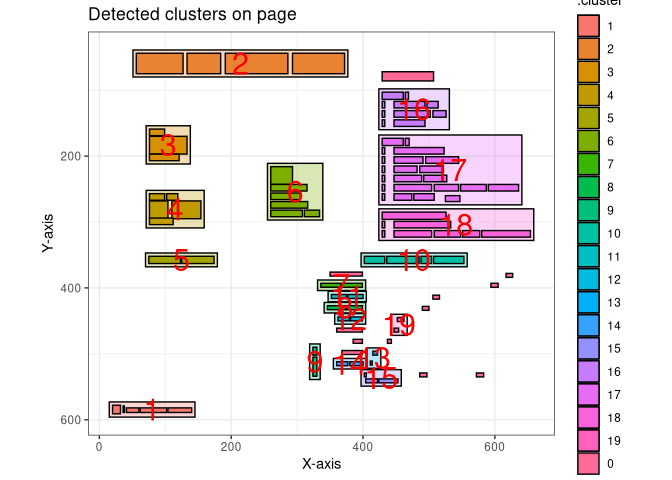

<!-- README.md is generated from README.Rmd. Please edit that file -->

# pdftextclusteR 

<!-- badges: start -->

[](https://lifecycle.r-lib.org/articles/stages.html#experimental)
[](https://github.com/coeneisma/pdftextclusteR/actions/workflows/R-CMD-check.yaml)

<!-- badges: end -->

The [pdftools](https://docs.ropensci.org/pdftools/) package is available
for importing PDF files. However, this package does not work optimally
when importing PDF files with multiple columns and text boxes. Since the
`pdftools::pdf_text()` function from the `pdftools` package processes
text line by line, it often fails to maintain the context of the text.
As a result, the output may contain sentences with unrelated fragments
of text from different parts of the page. Words that are not placed in
the correct context are unsuitable for text analysis.

However, the words grouped into clusters by this package using a
Density-Based Spatial Clustering algorithm are likely to be contextually
related and thus suitable for text analysis. This package directly
utilizes the clustering algorithms implemented in the
[dbscan](https://github.com/mhahsler/dbscan) package.

See `vignette("pdftextclusteR")` for more information on the usage of
the package.

## Installation

You can install the current version of pdftextclusteR using the
following code.

``` r
devtools::install_github("coeneisma/pdftextclusteR")
```

The latest version can be found on the development branch. You can
install it using the function:

``` r
devtools::install_github("coeneisma/pdftextclusteR",
  ref = "development")
```

## Example

This is a basic example of the capabilities of this package.

This example uses the bundled `cibap` dataset: the report
*Kwaliteitsagenda 2024-2027 Cibap*, read with `pdftools::pdf_data()`. To
use your own document, read it the same way:
`my_document <- pdftools::pdf_data("path/to/document.pdf")`.

``` r
library(pdftextclusteR)

# Detect clusters on page 18
cibap_clusters <- cibap[[18]] |> 
  pdf_detect_clusters()

# Plot the detected clusters
cibap_clusters |> 
  pdf_plot_clusters()
```



Compared with the original document it is quite accurate.


Text can be extracted to do further analysis:

``` r
cibap_clusters_text <- cibap_clusters |> 
  pdf_extract_clusters()

cibap_clusters_text
#> # A tibble: 19 × 3
#>    .cluster word_count text                                                     
#>    <fct>         <int> <chr>                                                    
#>  1 2                 4 "Facts and figures Cibap\n"                              
#>  2 16                7 "niveau 3\n • Filmmaker (AV)\n • Mediamaker (dtp)\n • Si…
#>  3 3                 3 "Circa\n 1650\n studenten\n"                             
#>  4 17               16 "niveau 4\n • Mediavormgever\n • Ruimtelijk Vormgever\n …
#>  5 6                 8 "7,6\n Beoordeling\n studenten\n job-monitor\n onderzoek…
#>  6 4                 5 "Meer dan\n 65 jaar\n ervaring\n"                        
#>  7 18                6 "excellentietrajecten\n • Restauratieschilder\n • Intern…
#>  8 5                 2 "Herkomst studenten\n"                                   
#>  9 10                4 "Aantal studenten per opleiding\n"                       
#> 10 7                 2 "Ruimtelijk vormgever\n"                                 
#> 11 11                2 "Creatief vakman\n"                                      
#> 12 8                 2 "Specialist Schilder\n"                                  
#> 13 12                2 "Media Maker\n"                                          
#> 14 19                2 "106\n 96\n"                                             
#> 15 9                 2 "Opleiding kort\n"                                       
#> 16 1                 5 "18 | Cibap werkagenda 2024-2027\n"                      
#> 17 14                2 "Social Design\n"                                        
#> 18 13                2 "19\n 8\n"                                               
#> 19 15                3 "0\n Aantal studenten\n"
```
