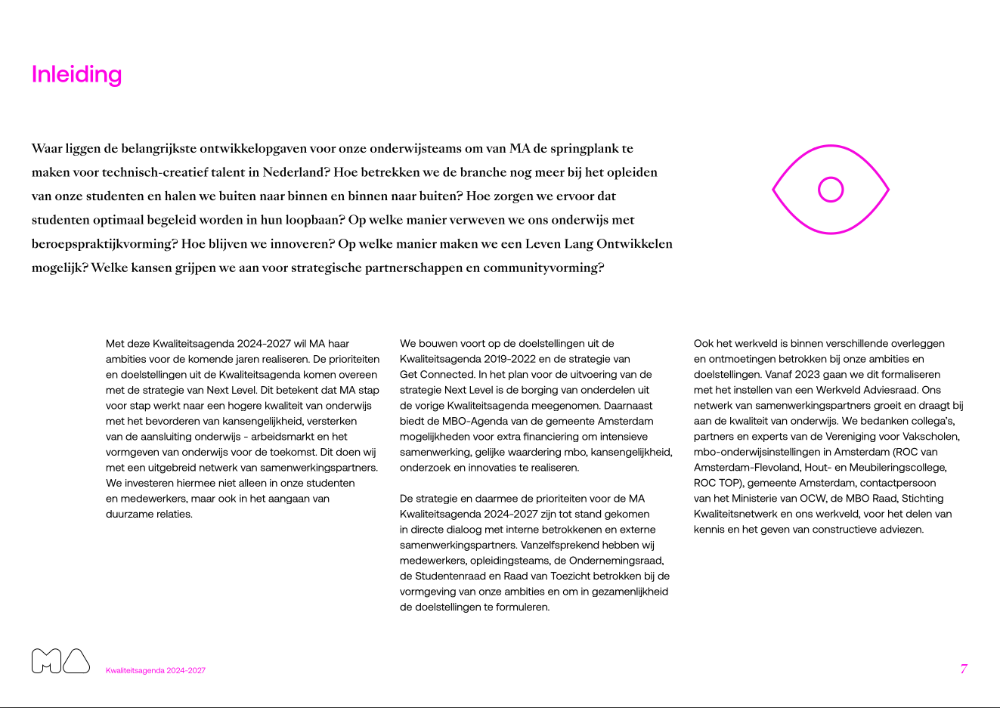

```{r, include = FALSE}
knitr::opts_chunk$set(
  collapse = TRUE,
  comment = "#>"
)
```

The [pdftools](https://docs.ropensci.org/pdftools/) package is available for importing PDF files. However, this package does not work optimally when importing PDF files with multiple columns and text boxes. Since the `pdftools::pdf_text()` function from the `pdftools` package processes text line by line, it often fails to maintain the context of the text. As a result, the output may contain sentences with unrelated fragments of text from different parts of the page. Words that are not placed in the correct context are unsuitable for text analysis.

However, the words grouped into clusters by this package using a Density-Based Spatial Clustering algorithm are likely to be contextually related and thus suitable for text analysis. This package directly utilizes the clustering algorithms implemented in the [dbscan](https://github.com/mhahsler/dbscan) package.

Below is an example of how to import a PDF file using the pdftools package, then detect columns with `pdf_detect_clusters()`, plot the results with `pdf_plot_clusters()` andd finally extract the text with `pdf_extract_clusters()` function.

For this example, the Quality Agenda 2024-2027 Mediacollege Amsterdam was used. More information about this report can be found at [rijksoverheid.nl](https://www.rijksoverheid.nl/documenten/rapporten/2024/06/10/kwaliteitsagenda-2024-2027-mediacollege-amsterdam).

## Loading Packages

```{r setup}
library(pdftools)
library(pdftextclusteR)
```

## Loading Data

Data is loaded using the `pdftools::pdf_data()` function. The result is a list object with a tibble for each page containing the data.

```{r error=FALSE, warning=FALSE, message=FALSE}
#' Reading a PDF document with `pdftools`
ka <- pdf_data("https://www.rijksoverheid.nl/binaries/rijksoverheid/documenten/rapporten/2024/06/10/kwaliteitsagenda-2024-2027-mediacollege-amsterdam/Kwaliteitsagenda+2024-2027+Mediacollege+Amsterdam.pdf")

```

The metadata for the first 5 words on page 7 are, for example:

```{r}
head(ka[[7]], 5)
```

## Detecting text clusters

Clusters - usually columns and text boxes - are detected with the `pdf_detect_clusters()` function.


```{r}
ka_clusters <- ka[[7]] |> 
  pdf_detect_clusters()

head(ka_clusters, 5)
```


## Plotting the Clusters

Using the `pdf_plot_clusters()` function, you can create a visual representation of the detected clusters:

```{r pdf_plot_clusters}
ka_clusters |> 
  pdf_plot_clusters()
```

If you compare this with the source PDF page, you can see that the package has clustered the text quite accurately in this case:



## Extract text from clusters

The text of the detected clusters can be extracted with the `pdf_extract_clusters()`. 

```{r}
ka_clusters_text <- ka[[7]] |> 
  pdf_detect_clusters() |> 
  pdf_extract_clusters()
```

The text from the first 5 clusters are:

```{r}
head(ka_clusters_text, 5)
```


## Different algorithms

The [dbscan](https://github.com/mhahsler/dbscan) package is used to detect the clusters. This package supports four different algorithms:

-   `dbscan`

-   `jpclust`

-   `sNNclust`

-   `hdbscan`

By default, the `dbscan` algorithm is used because it provides good results. However, as a user, you can also choose one of the other algorithms. Below is an example of clustering the same page using the `sNNclust` algorithm:

```{r}
ka[[7]] |> 
  pdf_detect_clusters(algorithm = "sNNclust") |> 
  pdf_plot_clusters()
```
